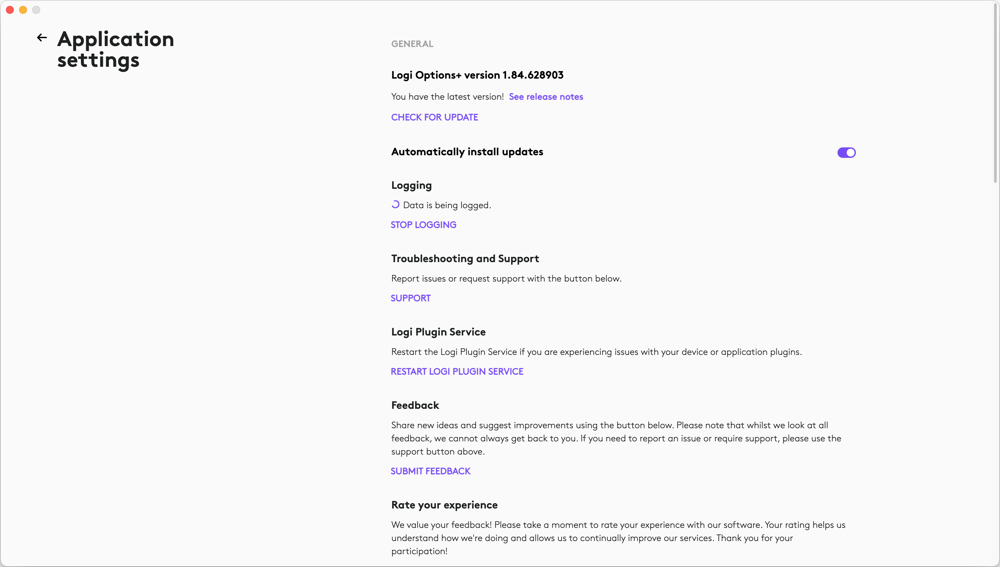
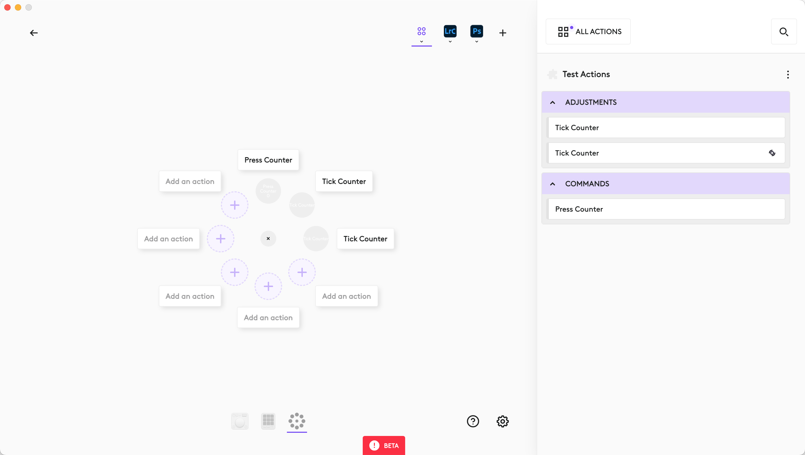

# Developing plugins for the Logi MX Creative Console

1.0, Oct 18, 2024

# Introduction

You are reading this because you want to write plugins for the Logi MX Creative Console devices. This document is meant to help you get up and running as quickly as possible. It is not meant to be an exhaustive developer guide. Links to detailed references are included at the end of this document.

# Getting Started

## Prerequisites

The following applications and libraries should be installed to be able to develop plugins:

* [.NET SDK 8](https://dotnet.microsoft.com/en-us/download/dotnet/8.0)

* [Logi Options+](https://www.logitech.com/en-ch/software/logi-options-plus.html)

* [The Logi Plugin Tool](https://support.loupedeck.com/hubfs/SDK_Beta_6.0/PluginSdkTools_6.0.0.20035.zip)

* An IDE, such as Visual Studio on Windows, or a programming editor, such as [VS Code](https://code.visualstudio.com/), including the [C\# and C\# DevKit extensions](https://marketplace.visualstudio.com/items?itemName=ms-dotnettools.csdevkit). Keep in mind that you need to sign up with a Microsoft account to use the C\# DevKit extension.

## Setting up the MX Creative Console

Start Logi Options+ and connect the two Creative Console devices. Once the onboarding is complete, your system is ready for developing plugins.

## Developing the plugin

A Logi plugin is written in C\# and is implemented as a dynamic loaded library. The Logi Plugin Tool is used to create new plugin projects as well as perform various operations on the plugin (pack, verify, install, etc.).

First, create a new plugin project:

On Windows:

`LoupedeckPluginTool.exe generate -name=MyProject`

On Mac:

`dotnet LoupedeckPluginTool.dll generate -name=MyProject`

Open the newly created project in VS Code. The main entry points for the plugin are the two files:

1. `CounterCommand.cs -` This is the implementation of a simple action which can be mapped to and triggered from any button on the creative console devices.

2. `CounterAdjustment.cs -` This implements an action with an associated scalar parameter which can be changed with the main dial or the roller of the MX Dial.

The plugin first needs to be compiled before it can be used. On Windows, simplify right-click on the project and select “Build”. On macOS, use the “.NET: Build” command in VS Code.

To make the plugin available inside Options+, you need to restart the Logi Plugin Service from the Options+ settings page:

Try out the plugin by assigning its actions to the MX Keys, MX Dial or Action Ring.

## Restarting the Logi Plugin Service

Keep in mind that the Logi Plugin Service (LPS) needs to be restarted after each change you make to the plugin. On Mac, either use the button in the UI shown above, or run the following at the command line:

`$ killall LogiPluginService`

On Windows, the simplest approach is to restart the LPS automatically by adding the following as a post-build instruction in the Visual Studio project settings:

`"C:\Program Files\Logi\LogiPluginService\LoupeTool.exe" "restart"`

## Logs

To help debug, the logs for the plugins can be found at the following location:

On Windows:  
`C:\Users\<USER_NAME>\AppData\Local\Logi\LogiPluginService\Logs`

On Mac:  
`~/Library/Application\ Support/Logi/LogiPluginService/Logs`

# Example Plugins

The official Loupedeck SDK Developer Docs include the [source code for a demo plugin](https://github.com/Logitech/actions-sdk) showcasing the basic functionality of the SDK.  
An additional [example Sketch plugin](https://github.com/radupopescu-logi/logi-plugin-sdk-sketch-plugin/tree/master) shows how to establish a connection from the C\# plugin to a browser page using WebSocket.

# Useful links

[Logi MX Creative Console](https://www.logitech.com/fr-ch/products/keyboards/mx-creative-console.html)

[Logi/Loupedeck Plugin SDK Install Instruction](https://loupedeck.github.io/Closed-Beta-6.0/)

[Logi/Loupedeck Plugin SDK Developer Docs](https://loupedeck.github.io/)

[Loupedeck SDK Developer Docs Demo Plugin Source Code](https://github.com/Logitech/actions-sdk)

[Example Sketch Plugin Source Code](https://github.com/radupopescu-logi/logi-plugin-sdk-sketch-plugin/tree/master)

